## ChatGPT使用说明

### 准备

- 科学上网（韩国，日本，印度，新加坡，美国）这几个地址。其他的不太清楚，反正香港肯定不行。

- 国外手机号接收码。可以购买一个。6块钱左右。[接码地址](https://sms-activate.org)

### 一、注册账号

1. 准备接码

	打开[接码平台](https://sms-activate.org)注册一个账号
	
	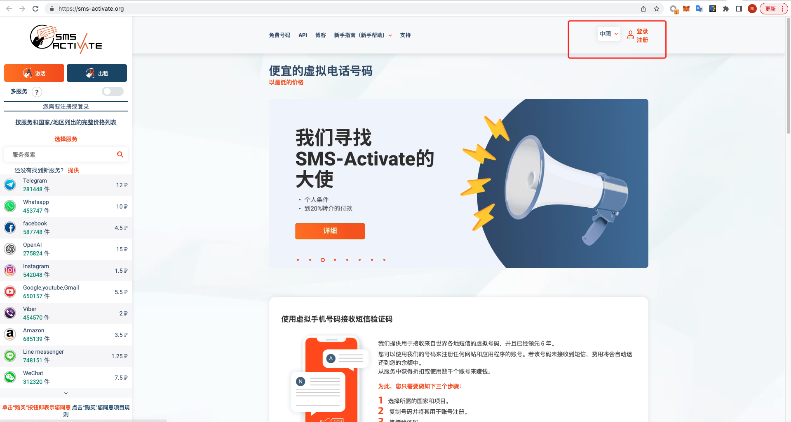
	
	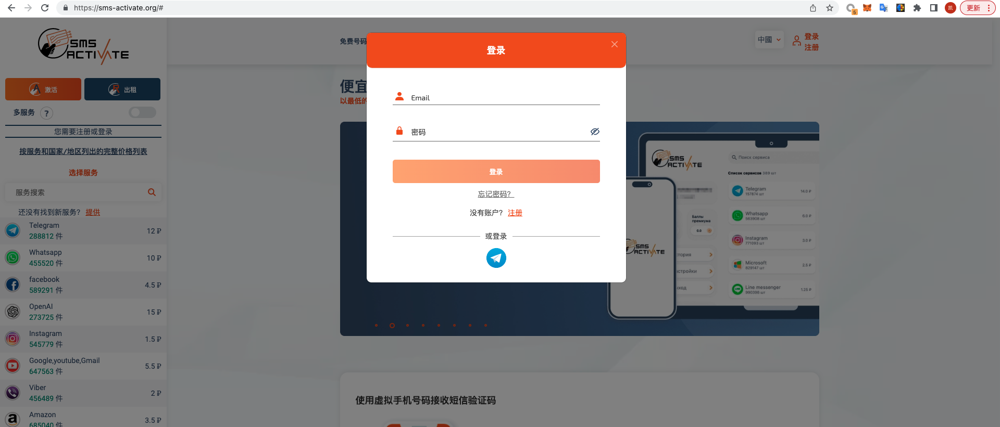

	充值，单位是卢布。可以选择支付宝付款
	
	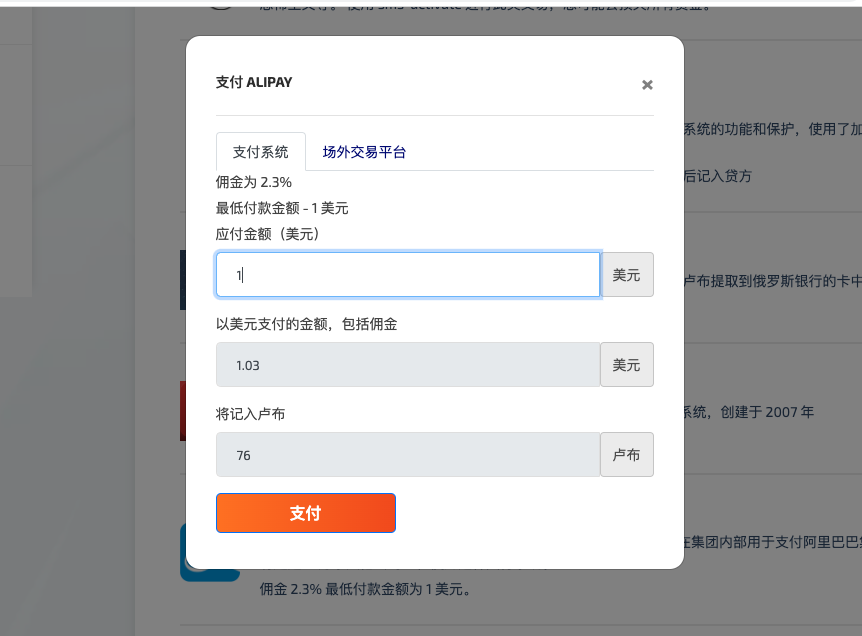
	
	充值完成需要等一会，就先放着，直接进行下一步。
	
	
2. 注册OpenAI账号	

	打开[ChatGPT的账户注册页面](https://beta.openai.com/signup)谷歌账号和普通邮箱都可以
	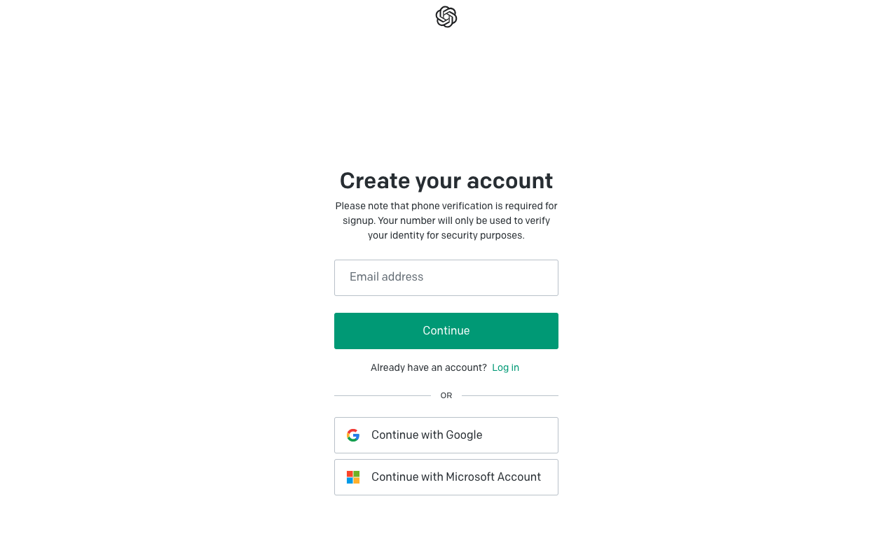
	
	用邮箱注册后有个验证邮件，进去邮箱，点开链接。
	
	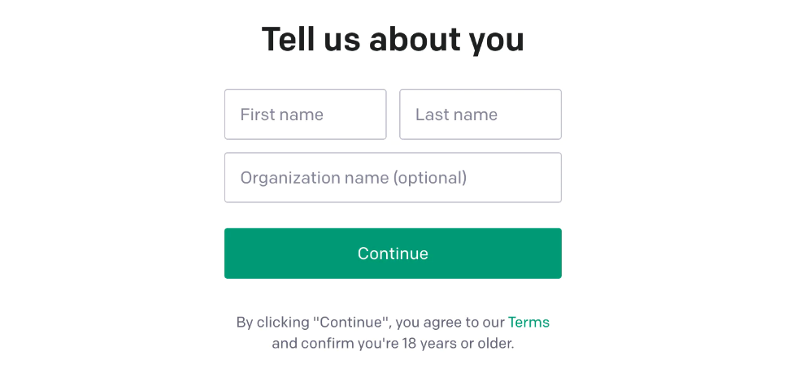
	
	
3. 验证码获取

	切换到接码平台,选择一个地区的号码。可以选择印度
	
	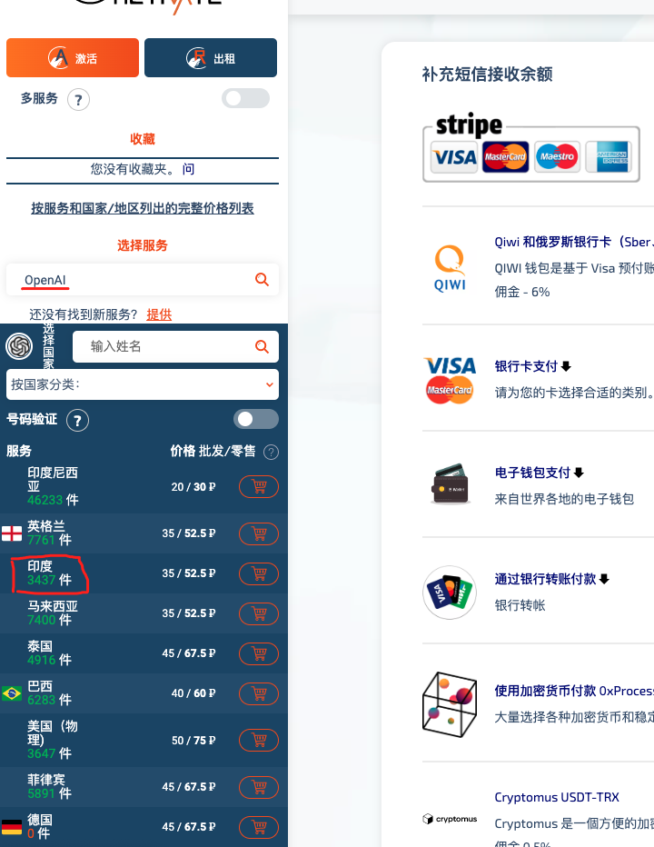
	
	点击小黄车。
	
	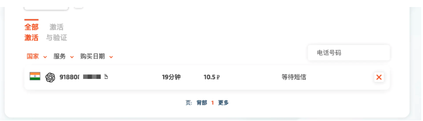
	
	然后我们复制这个号码，粘贴过去。然后我们点击发送验证码就完事了。

	等一会网站会提示验证码，我们复制粘贴。
	
	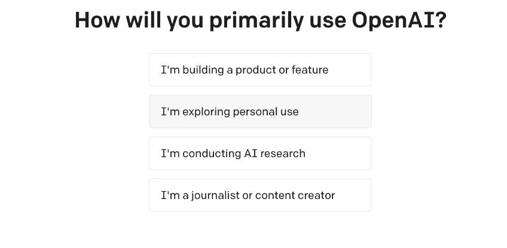
	
	这样就成功了，随便点一个进去完事。
	
	
### 二、使用ChatGPT

注册完成后，进入ChatGPT [登录界面](https://chat.openai.com/auth/login)

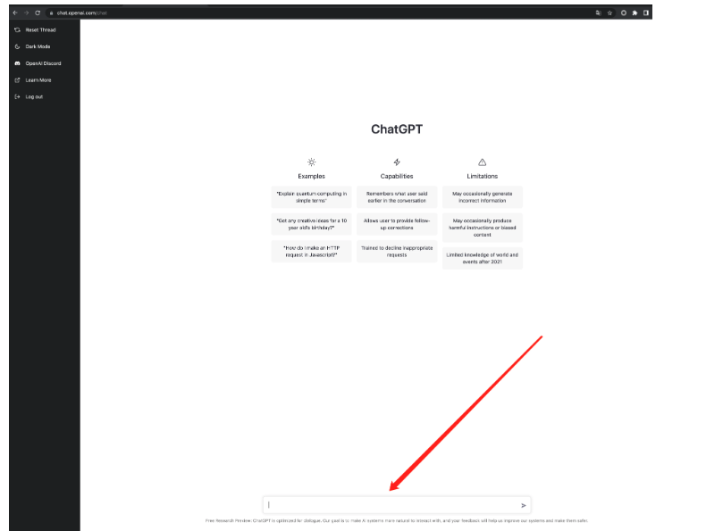

在这个输入框里就可以询问ChatGPT了。

- 示例：帮我设计一个常规的用户权限控制的数据库表结构，以表格的形式展现

	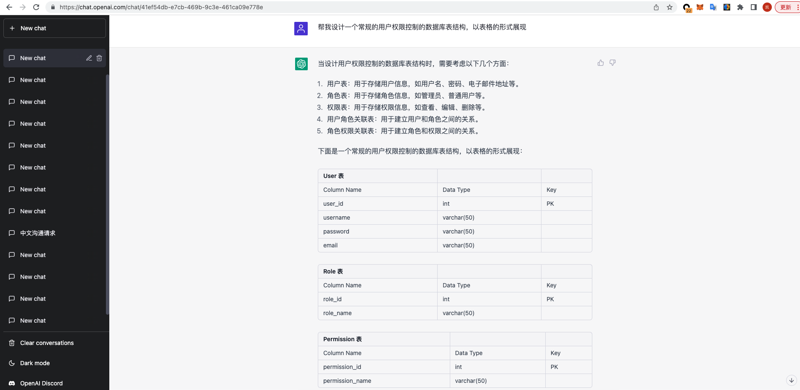
	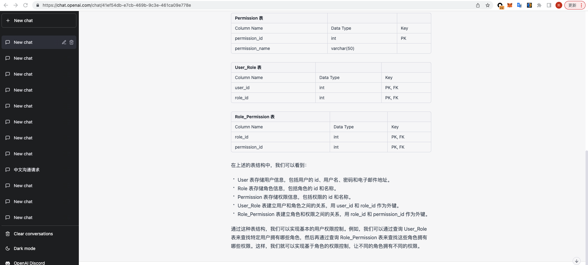
	
	看上去还挺标准。
	
- 示例：中国红烧肉的做法，以表格和图片的形式展现

	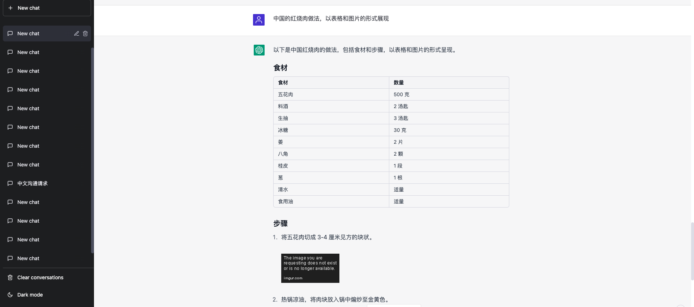
	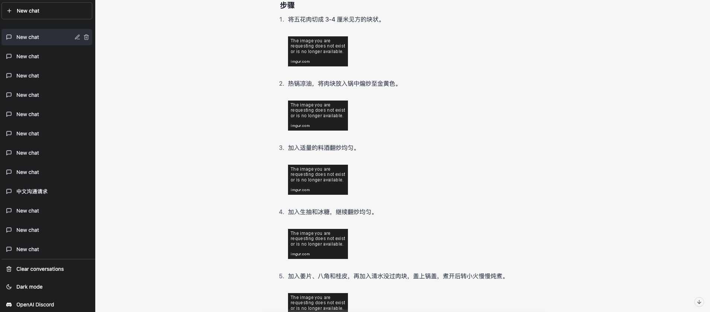
	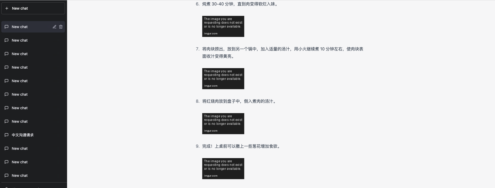
	
	图片它加载不出来了，我看了下图片链接，是因为网站上的图片资源不存在了，显示404.它区分不了图片在不在，这结果也还行。
	

### 三、参考链接

上述使用文档，参考如下链接，需要科学上网：

- https://mirror.xyz/boxchen.eth/9O9CSqyKDj4BKUIil7NC1Sa1LJM-3hsPqaeW_QjfFBc

### 四、开发者使用OpenAI

这是一个可协助编程的开发模式，根据用户语义生成代码，通用的算法代码，它实现的非常好，如果是与业务紧密耦合的需求，需要提供更精准的信息，以及上下文。ChatGPT也会自动获取上下文，所以不用一次性提供很多信息，可以根据ChatGPT给你的回复，然后再提其他的问题。

- https://platform.openai.com/playground
- 示例：雪花算法

	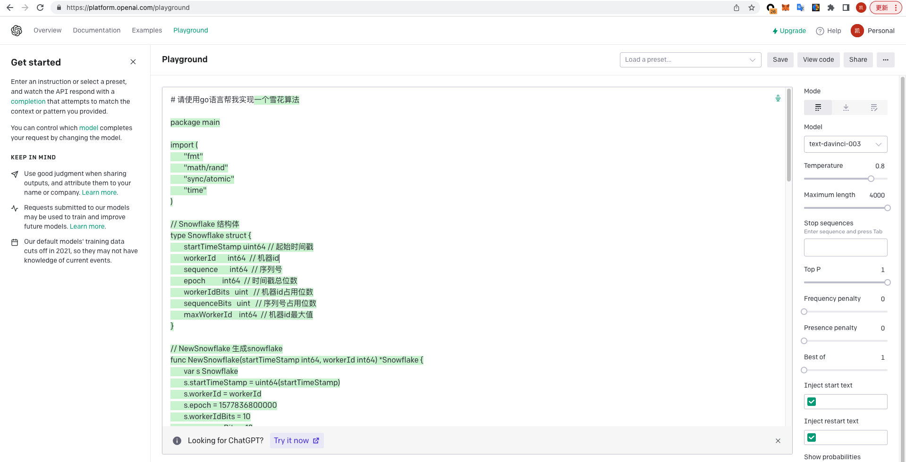
	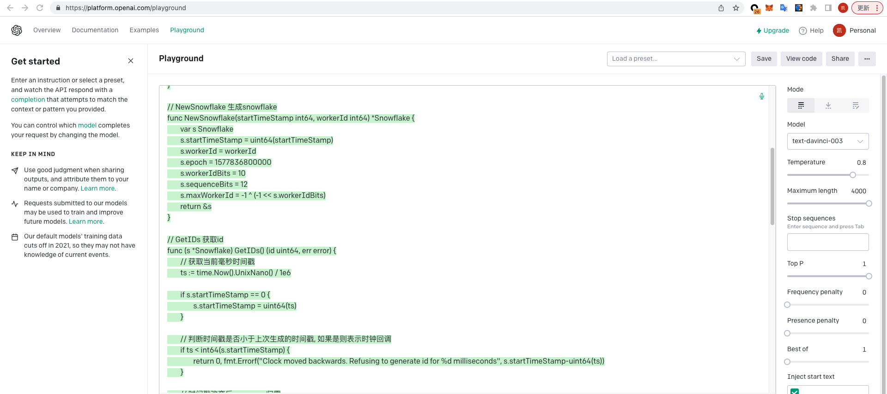
	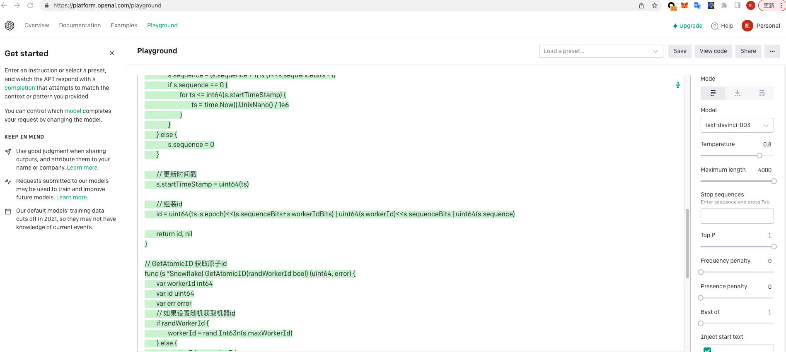
	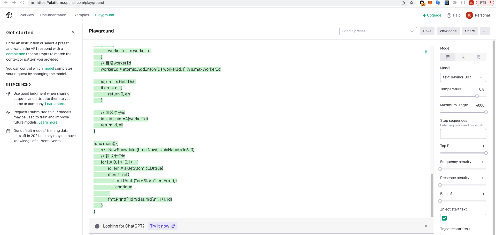
	
	本地测试下这个算法,是可以直接复制粘贴使用的。
	

### 五、总结

ChatGPT两种模式都可以使用，第一种更面向大众，很多问题它都可以帮你找到答案，当然也是需要用户提供更多的信息源;第二种更倾向于程序开发者。playground也是有计算模型的使用规则，如何才能更精准地生成想要的代码还是需要看开发文档的。上述就是ChatGPT的使用方式了，大家可以自己玩玩试试。