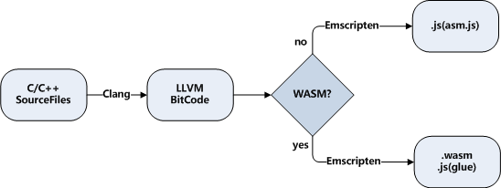
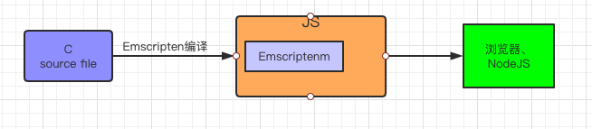
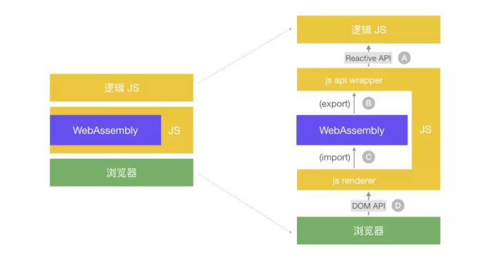
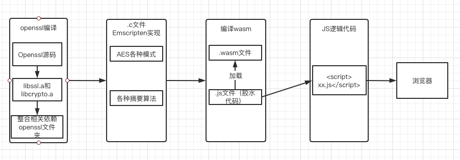

### WASM编译Openssl研究进度

#### 文档概要

- 入门级: WASM编译工具安装
- 实战：编译openssl，并且调用
	- 未解决的问题： 
		- 如何在C代码中使用WebAssembly语法.
		- 在 js 和 wasm 之间传递复杂数据结构。
	- 一个md5实现的例子
- Openssl编译到WebAssembly并且使用的流程
- 参考文章梳理

#### 一、入门级

- WASM编译环境安装（OK）

	- Windows10中Emscripten 安装详解（有例子）： https://blog.csdn.net/cnds123/article/details/106742371
	

- EMCC编译C/C++流程（OK）

 
 
  1. C/C++代码首先通过Clang编译为LLVM字节码，然后根据不同的目标编译为asm.js或wasm
  2. 由于内部调用Clang，因此emcc支持绝大多数的Clang编译选项。比如-s OPTIONS=VALUE、-O、-g等。除此之外，为了适应Web环境，emcc增加了一些特有的选项，如--pre-js <file>、--post-js <file>等。

- 需要掌握EMCC编译的命令参数（未掌握）

	```
	emcc --help 
	
	```
	借鉴文档（参数说明）：https://blog.csdn.net/wngzhem/article/details/105192706
  
#### 二、实战

#### 1. 以Openssl为例，需求：
	
	1. 将openssl编译成.wasm文件。
	2. js可以调用openssl.wasm文件，直接使用openssl的对称和非对称加密，以及各种摘要算法。

#### 2. 技术方案

##### Openssl编译：
	
	


	1. 将openssl的.c文件使用emcc编译成openssl.js和openssl.wasm文件

		emcc openssl.c -I /Users/likai/hisun/resource/openssl/include -L /Users/likai/hisun/resource/openssl/libs -lcrypto -s EXTRA_EXPORTED_RUNTIME_METHODS='["cwrap", "ccall"]' -o openssl.js
		
	2. Openssl.js和openssl.wasm之间是调用关系，openssl.js加载openssl.wasm并且调用里面的exports方法。

##### 接口调用关系:



	1. 这是网上抄的图，调用逻辑都一样，这里的DOM API如果有需要是要封装成js接口，编译的时候注入到C代码里。
	 
	2. 参考：一次C项目编译的实践: https://zhuanlan.zhihu.com/p/258560278

#### 3. 误区

- Openssl不是整体编译就能出来一个.wasm文件的。整体编译只有libssl.a libcrypto.a
- 如果想要使用openssl的摘要算法和加解密算法，需要使用C代码调用openssl的方法，其中C代码要依赖WebAssembly相关语法。
- emcc是可以多个文件同时编译，最终生成一个.wasm 或者 .js文件。所以可以尝试自己实现各个算法后整合。

#### 4. 未解决的问题

	1. 没有彻底看懂openssl源码，不知道加解密算法、摘要算法调用的入口在哪里，或者说是如何用C调用这些算法的问题。 导致直接编译某个加解密算法的.c文件后无法使用。
	
	2. 解决上述问题，考虑使用js调用C语言，或者是两者互调的方式实现算法，然后编译。（需要学习Emscripten语法）
	
	3. JS逻辑代码调用wasm，需要掌握WebAssembly API的使用。

#### 5. 试着完成一个md5的算法：

 - 编译openssl源码，生成libssl.a libcrypto.a文件，参考下面文章部分内容即可生成。
 	- Mac编译openssl到WebAssembly: https://asyncoder.com/2020/01/02/Mac%E4%B8%8A%E7%BC%96%E8%AF%91openSSL%E5%88%B0WebAssembly/  
 
 - 调用openssl中的加密方法，以md5为例

 ```
// md5.c
#include <emscripten.h>
#include <openssl/md5.h>
#include <string.h>
#include <stdio.h>

EMSCRIPTEN_KEEPALIVE
void md5(char *str, char *result) {
  MD5_CTX md5_ctx;
  int MD5_BYTES = 16;
  unsigned char md5sum[MD5_BYTES];
  MD5_Init(&md5_ctx);
  MD5_Update(&md5_ctx, str, strlen(str));
  MD5_Final(md5sum, &md5_ctx);
  char temp[3] = {0};
  memset(result, sizeof(char) * 32, 0);
  for (int i = 0; i < MD5_BYTES; i++) {
    sprintf(temp, "%02x", md5sum[i]);
    strcat(result, temp);
  }
  result[32] = '\0';
}
 	
 ```
 	这里引入了 emscripten.h 来解决JS调用C语言的问题.
 	
 - emcc 命令
 	
 		emcc md5.c -I /Users/likai/hisun/resource/openssl/include -L /Users/likai/hisun/resource/openssl/libs -lcrypto -s EXTRA_EXPORTED_RUNTIME_METHODS='["cwrap", "ccall"]' -o md5.js
	
		生成md5.js和md5.wasm两个文件，md5.wasm文件可以说是wasm文件，md5.js就是wasm和js文件交互的桥梁。

- JS调用

	```
	<!DOCTYPE html>
    <html lang="en">
    <head>
        <meta charset="UTF-8">
        <title>Md5 wasm</title>
    </head>
    <body>
    <div>
        <input type="file" id="files" style="display: none" onchange="fileImport();">
        <input type="button" id="fileImport" value="导入">
    </div>
    <script src="md5.js"></script>
    <script src="jquery-3.5.1.min.js"></script>
    <script type='text/javascript'>
        //点击导入按钮,使files触发点击事件,然后完成读取文件的操作
        $("#fileImport").click(function() {
            $("#files").click();
        })
    
        function fileImport() {
            //获取读取我文件的File对象
            var selectedFile = document.getElementById('files').files[0];
            var name = selectedFile.name; //读取选中文件的文件名
            var size = selectedFile.size; //读取选中文件的大小
            console.log("文件名:" + name + "大小:" + size);
            var reader = new FileReader(); //这是核心,读取操作就是由它完成.
            reader.readAsBinaryString(selectedFile)
            //reader.readAsText(selectedFile); //读取文件的内容,也可以读取文件的URL
            reader.onload = function() {
                //当读取完成后回调这个函数,然后此时文件的内容存储到了result中,直接操作即可
                console.log(reader.result);       
                //下面逻辑直接调用md5.js中的方法和属性
                const mallocByteBuffer = len => {
                    var buf = new ArrayBuffer(len);
                    const ptr = _malloc(len)
                    const heapBytes = new Uint8Array(HEAP8.buffer,ptr, len)
                    return heapBytes
                }
                const array = Array.from(reader.result).map(v => v.charCodeAt(0))
                const inBuffer = mallocByteBuffer(array.length)
                inBuffer.set(array)
                const outBuffer = mallocByteBuffer(32)
                _md5(inBuffer.byteOffset,outBuffer.byteOffset)
                console.log(Array.from(outBuffer).map(v => String.fromCharCode(v)).join(''))
            }
        }
    </script>
    </body>
    </html>

	```
- 运行

	```
	emrun --no_browser --port 8080 ~/hisun/gospace/src/aes-stu/js/md5/md5.html
	
	consul结果:
	
    文件名:HelloWorld.txt大小:13
    md5.html:31 Hello World
    
    md5.html:43 a349e7a744d1dcaba35d9020fdfff9f0
	```
- 源码位置

  同级目录下，demo目录
  
#### 三、Openssl编译到WebAssembly并且使用的流程（可能有更好的方案）



#### 四、参考文档梳理

- Mac编译openssl到WebAssembly: https://asyncoder.com/2020/01/02/Mac%E4%B8%8A%E7%BC%96%E8%AF%91openSSL%E5%88%B0WebAssembly/ 

- WebAssembly API（中文，解决逻辑JS调用wasm问题。）：https://developer.mozilla.org/zh-CN/docs/WebAssembly#API%E5%8F%82%E8%80%83

- Emscripten 语法学习（解决C语言调用JS问题）：https://emscripten.org/docs/api_reference/emscripten.h.html#c.EM_ASM_

	- 入门参考： http://www.ruanyifeng.com/blog/2017/09/asmjs_emscripten.html 

#### END
