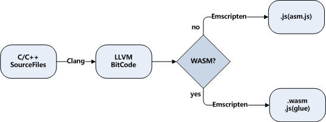
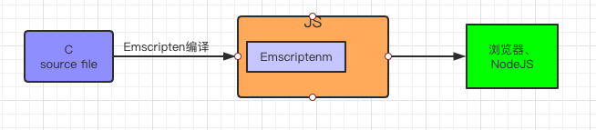
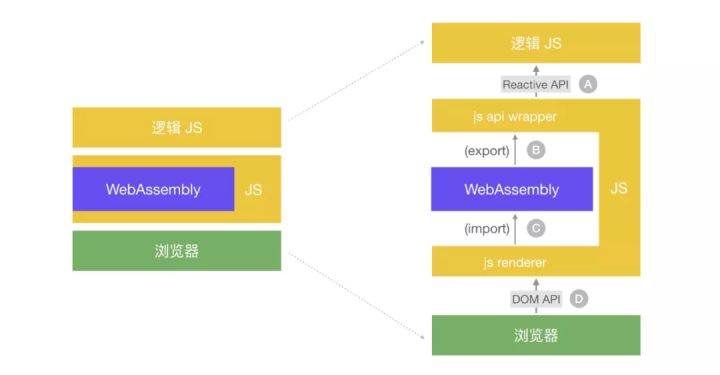
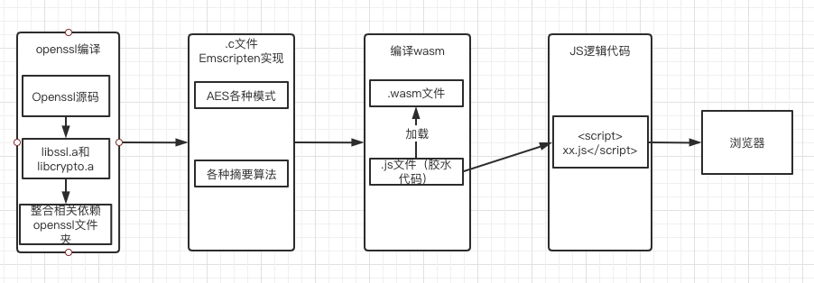

### 一次Webassembly的实践

#### 知识点提炼
	
- Webassembly简单介绍。
- Webassembly本地安装。
- Webassembly实践，以openssl项目为例。
- Webassembly实践中遇到的问题，以及解决办法。
- 参考资料

#### 一、 Webassembly介绍

##### 1. 什么是Webassembly？

	WebAssembly是一种运行在现代网络浏览器中的新型代码，并且提供新的性能特性和效果。它设计的目的不是为了手写代码而是为诸如C、C++和Rust等低级源语言提供一个高效的编译目标。
	
	对于网络平台而言，这具有巨大的意义——这为客户端app提供了一种在网络平台以接近本地速度的方式运行多种语言编写的代码的方式；在这之前，客户端app是不可能做到的。
	
	而且，你在不知道如何编写WebAssembly代码的情况下就可以使用它。WebAssembly的模块可以被导入的到一个网络app（或Node.js）中，并且暴露出供JavaScript使用的WebAssembly函数。JavaScript框架不但可以使用WebAssembly获得巨大性能优势和新特性，而且还能使得各种功能保持对网络开发者的易用性。
	

上述内容摘自官方文档，简单点就是：浏览器可以用除JS以外的其他语言了；WebAssembly的性能还挺好；
	
##### 2. 为什么我们需要 WebAssembly？

	想一想除了浏览器之外你所使用软件：游戏，视频编辑，3D渲染或音乐制作。这些应用程序需要执行大量计算，并且需要很高的性能。JavaScript 很难满足这种高性能的要求。
	
	JavaScript 最初是一种简单的脚本语言，旨在为充满轻量级超文本文档的 Web 应用带来一些交互性。它的设计易于学习和编写，并不追求运行速度。多年来，浏览器在 JavaScript 解析上的重大性能改进的，带来了显著的性能提升。
	
	随着 JavaScript 运行速度的加快，能浏览器中执行的东西大大扩展。新的 API 带来了诸如交互式图形，视频流，离线浏览以及更多的功能。同时越来越多的富应用程序（过去仅限本地应用程序）开始进入 Web 。现在你可以轻易的在浏览器中编辑文档并发送电子邮件，但在有些领域中，JavaScript 的性能依旧是一个难题。
	
	游戏尤其具有挑战性，因为游戏不仅需要同时执行音频和视频处理，还需要协调物理特效和AI。拥有在Web上高效的运行游戏的能力，将打开把许多其他应用程序带到 Web 上的大门。这就是WebAssembly所要做到的事情。
	
##### 3. WebAssembly 带来了什么？

	WebAssembly 的特点和特别适合 Web应用的原因是：
	速度
	可移植性
	灵活性
	
	WebAssembly 的目标是速度。它的二进制文件比 JavaScript 文本文件小得多。因而下载速度更快，这在网速低的时候尤为重要。
	
	速度。WebAssembly本身就以二进制形式提供，解析速度更快。它是静态类型的，因此与JavaScript不同，引擎在编译期间不需要类型推断。大多数优化都是在编译源代码期间，在浏览器执行之前进行的。内存是手动管理的，就像 C 和 C++ 这样的语言一样，所以也没有垃圾收集。所有这些都是为了提供了更好，更可靠的性能。 WASM 二进制文件的执行时间比执行相同的原生代码只慢了20％。
	
	可移植性。设计WebAssembly的主要目标之一是可移植性。 要在某个设备上运行应用程序，它必须兼容设备的处理器架构和操作系统。这意味着要为支持的操作系统和CPU架构的每个组合编译源代码。 使用 WebAssembly ，只需要一次编译，您的应用程序将可以在每个现代浏览器中运行。

	你不仅可以将自己的应用程序移植到 Web ，还可以移植现存的 C++ 库和开源应用程序，WebAssembly几乎支持所有平台，包括 iOS 和 Android。WebAssembly可以用作 Web 和 移动应用的通用语言。
	
	灵活性。WebAssembly 最令人兴奋的是它为 Web 应用编写带来了更大的灵活性。JavaScript 一直是 Web 浏览器中唯一完全支持的语言。使用 WebAssembly，Web开发人员将能够选择其他语言，更多的开发人员将能够为 Web应用 编写代码。JavaScript 仍然是大多数用例的最佳选择，但是现在有可以在你真正需要提升性能的时候的提供一个额外的选项，使用某个特定的语言。 UI 和 app 逻辑等部分可以依旧使用JavaScript，其中核心功能可以使用 WebAssembly。在优化现有JS应用程序的性能时，可以使用更适合解决问题的语言重写瓶颈部分的代码。

##### 4. WebAssembly 工作原理

	首先你需要一个将源代码编译为 WebAssembly 的工具，推荐使用emsdk，下载地址：git clone https://github.com/juj/emsdk.git，后续会介绍如何在本地安装。我们先说下WebAssembly的工作原理：如图



这是一个WebAssembly编译过程的图例，C/C++代码首先通过Clang编译为LLVM字节码，然后根据不同的目标编译为asm.js或wasm。

可以将 WebAssembly 二进制文件视为常规 Web 应用程序的模块：浏览器可以获取，加载并执行。WebAssembly 同样具有 import 和 exports ，就像使用 JavaScript 对象一样。可以在 JavaScript 代码中调用 WebAssembly 函数，也可以在 WebAssembly 模块中调用 JavaScript 函数。

WebAssembly 只有四种原始类型，都是数字 - 整数(integer)和浮点数(float)(i32，i64，f32和f64)。这意味着在 JavaScript 和 WebAssembly 之间传递复杂的数据类型并不简单。例如，如果要传递字符串，则必须将其编码为数字数组，然后将指针传递给 WebAssembly 。WebAssembly 只能从自己的线性内存空间中执行读写操作，不能直接访问外部的 JavaScript 变量，除非它们被复制到内存中或通过调用堆栈传递。
		
现在通过JavaScript进行大量 WebAssembly 调用的速度并不是非常快，因为引擎每次都必须进行一些初始化工作。 这可能在未来很可能会发生变化，但现在的建议是将 WebAssembly 视为一个孤立运行的系统，使用它来执行的繁重但是成块的内容。

#### 二、	MAC上安装Webassembly

1. 环境依赖

	- Git
	
	- CMake 
	
		- brew install cmake
	
	- Python 2.7.x 默认安装过

2. 编译Emscripten

	```
	下载源码：git clone https://github.com/juj/emsdk.git
	
	cd emsdk
	
	# 编译源码
	./emsdk install latest
	
	# 激活sdk
	./emsdk activate latest
	
	#设置环境变量
	source ./emsdk_env.sh
	
	```

	- 这里安装会遇到一些问题，没有科学上网的原因。如：

		./emsdk install latest 报错

	```
	./emsdk install latest

	Installing SDK 'sdk-releases-upstream-7a7f38ca19da152d4cd6da4776921a0f1e3f3e3f-64bit'..
	Installing tool 'node-12.18.1-64bit'..
	Error: Downloading URL 'https://storage.googleapis.com/webassembly/emscripten-releases-builds/deps/node-v12.18.1-darwin-x64.tar.gz': <urlopen error unknown url type: https>
	Warning: Possibly SSL/TLS issue. Update or install Python SSL root certificates (2048-bit or greater) supplied in Python folder or https://pypi.org/project/certifi/ and try again.
	Installation failed!

	```

	- 解决办法就是使用python脚本安装,如：
	
	```
	./emsdk.py install latest
	
	./emsdk.py activate latest
	
	source ./emsdk_env.sh
	
	```
	
3. 验证是否安装成功

	- emcc -v 不报错就算成功了。

	```
	emcc -v
	
	emcc (Emscripten gcc/clang-like replacement + linker emulating GNU ld) 2.0.3
	clang version 12.0.0 (/b/s/w/ir/cache/git/chromium.googlesource.com-external-github.com-llvm-llvm--project a39423084cbbeb59e81002e741190dccf08b5c82)
	Target: x86_64-apple-darwin19.4.0
	Thread model: posix
	InstalledDir: ~/resource/emsdk/upstream/bin
	shared:INFO: (Emscripten: Running sanity checks)
	
	```
	
	- 获取帮助

	```
	emcc --help
	```
4. 给了例子试试

	- 写一个test.c文件，里面是加减乘除计算。
		
		```
		//test.c
		char* toChar (char* str) {
		  return str;	
		}
		
		int add (int x, int y) {
		  return x + y;
		}
		
		int square (int x) {
		  return x * x;
		}
	
		```

	- 编译成.wasm文件

		```
		emcc ./test.c -Os -s WASM=1 -s SIDE_MODULE=1 -o ./test.wasm
		```
	- 写一个html，调用.wasm文件

		```
		<!DOCTYPE html>
		<html lang="en">	
		<head>	
		  <meta charset="UTF-8">
		  <title>Document</title>
		</head>
		<body>
		<script>
		  /**
		
		   * @param {String} path wasm 文件路径
		
		   * @param {Object} imports 传递到 wasm 代码中的变量
		
		   */
		
		  function loadWebAssembly (path, imports = {}) {
		    return fetch(path) // 加载文件
	            .then(response => response.arrayBuffer()) // 转成 ArrayBuffer
	            .then(buffer => WebAssembly.compile(buffer))
	            .then(module => {
	              imports.env = imports.env || {}
	              // 开辟内存空间
	              imports.env.memoryBase = imports.env.memoryBase || 0
		
	              if (!imports.env.memory) {
	                imports.env.memory = new WebAssembly.Memory({ initial: 256 })
	              }
	              // 创建变量映射表
	              imports.env.tableBase = imports.env.tableBase || 0
		
	              if (!imports.env.table) {
	                // 在 MVP 版本中 element 只能是 "anyfunc"
	                imports.env.table = new WebAssembly.Table({ initial: 0, element: 'anyfunc' })
	              }
	              // 创建 WebAssembly 实例
	              return new WebAssembly.Instance(module, imports)
	            })
		  }
		
		  // 加载wasm文件
		  loadWebAssembly('test.wasm')
		          .then(instance => {
		            //调用c里面的方法
		            const toChar = instance.exports.toChar
		            const add = instance.exports.add
		            const square = instance.exports.square
		
		            console.log('return:   ', toChar("12352324"))
		            console.log('10 + 20 =', add(10, 20))
		            console.log('3*3 =', square(3))
		            console.log('(2 + 5)*2 =', square(add(2 + 5)))
		
		          })
		</script>
		</body>
		</html>
		
		```
	- 运行服务

		```
		emrun --no_browser --port 8080 ./test.html
		
		```
		
		访问: http://localhost:8080/test.html 查看consul
		
		```
		return:    12352324
		test.html:88 10 + 20 = 30
		test.html:90 3*3 = 9
		test.html:92 (2 + 5)*2 = 49
		
		```
	

#### 三、 Webassembly实践，以openssl项目为例。

1. 项目背景

	想用前端JS实现一个文件加密的功能，会用到摘要算法（md5,sha1,sha256）,对称加密（AES）和非对称加密（RSA）。前端加密库也是有的，openssl的加密库更全面一点，考虑使用Webassembly编译openssl，是在js中使用，看会遇到哪些问题。重点讲述下调用openssl库的整个过程。

2. 需求分析

	- 要实现的目标 
		
		首先细化一下要实现的目标，下面是一段调用openssl API的C代码，目标是将这段C代码运行在浏览器中。这里引入的openssl/md5.h和openssl/sha.h是把openssl编译成静态库进行调用的，因为是wasm调用吗，所以需要使用wasm的编译工具进行源码编译。详细请参考MAC上编译openssl到Webassembly：https://asyncoder.com/2020/01/02/Mac%E4%B8%8A%E7%BC%96%E8%AF%91openSSL%E5%88%B0WebAssembly/
		
		```
		// md5.c
		#include <emscripten.h>
		#include <openssl/md5.h>
		#include <openssl/sha.h>
		#include <string.h>
		#include <stdio.h>
		
		EMSCRIPTEN_KEEPALIVE
		void md5(char *str, char *result, int strlenth) {
		  MD5_CTX md5_ctx;
		  int MD5_BYTES = 16;
		  unsigned char md5sum[MD5_BYTES];
		  MD5_Init(&md5_ctx);
		  MD5_Update(&md5_ctx, str, strlenth);
		  MD5_Final(md5sum, &md5_ctx);
		  char temp[3] = {0};
		  memset(result,0, sizeof(char) * 32);
		  for (int i = 0; i < MD5_BYTES; i++) {
		    sprintf(temp, "%02x", md5sum[i]);
		    strcat(result, temp);
		  }
		  result[32] = '\0';
		}
		
		EMSCRIPTEN_KEEPALIVE
		void sha1(char *str, char mdString[],int strlen) {
		    unsigned char digest[SHA_DIGEST_LENGTH];
		    SHA_CTX ctx;
		    SHA1_Init(&ctx);
		    SHA1_Update(&ctx, str, strlen);
		    SHA1_Final(digest, &ctx);
		   // char mdString[SHA_DIGEST_LENGTH*2+1];
		    for (int i = 0; i < SHA_DIGEST_LENGTH; i++){
		        sprintf(&mdString[i*2], "%02x", (unsigned int)digest[i]);
		    }
		}
		
		```
		
		这是两个函数，一个是计算md5值，一个是计算sha1的值，都是调用了openssl的原生函数计算而来。
		
	- 遇到的问题
		
		- 在 C/C++ 和 JS 之间传递复杂数据结构。（数据通信）

			如果使用上面的例子来跑通整个流程，就是要实现这么一个调用链路：
			
			```
			demo.js <-----> md5.c <-----> openssl API
				
			```
			
			上述md5，sha1的计算方式都是C实现的，接收的参数是明文的char指针类型，返回结果的char指针类型，以及明文的长度int类型。然而 wasm 目前只可以 import 和 export C 语言函数风格的 API，而且参数只有四种数据类型（i32, i64, f32, f64），都是数字，可以理解为赤裸裸的二进制编码，没法直接传递复杂的类型和数据结构。**所以在浏览器中这些高级类型的 API 必须靠 JS 来封装，中间还需要一个机制实现跨语言转换复杂的数据结构。**
			
			```
			WebAssembly 是一种编译目标，虽然运行时是 wasm 和 JS 之间互相调用，但是写代码的时候感知到的是 C++ 和 JS 之间的互相调用。文中说的 JS 和 C++ 的调用，实际意思是 JS 和 wasm 模块之间的调用。
			```
3. 技术方案

- 如何编译代码

	前面介绍了本地编译安装Emscripten，这是一个编译wasm的工具，用来编译生成wasm文件，和js文件。
	
	

	我们的目标是C语言程序跑在浏览器中，所以使用Emscripten来编译，生成js文件来辅助运行，具体怎么编译，根据官方文档配置下。
	
	```
	emcc md5.c -I ~/resource/openssl/include -L ~/resource/openssl/libs -lcrypto -s EXTRA_EXPORTED_RUNTIME_METHODS='["cwrap", "ccall"]' -s ALLOW_MEMORY_GROWTH=1 -o md5.js
	
	```
	生成md5.wasm和md5.js两个文件，算上上面的 demo 文件，一共有三个文件，大概的执行顺序是 ：

	1. demo程序的html
	
	2. 生成的.js和.wasm文件
	
- 接口的互相调用
	
	| A | B | C | D |
	| --- | :--- | :--- | :--- |
	|md5.html  | md5.js | md5.wasm| 浏览器 |
	
	其中BC之间是依赖关系，B加载C，并且调用。
	A是上传文件的逻辑，直接调用B的逻辑方法。整体流程长这个样子：
	
	

	图中 (A) 透出的接口就是上面 md5.html 用到的接口，主要是一个md5和sha1的两个算法。(D) 就是前端很熟悉的 DOM API，不再赘述。中间响应式框架这层把 wasm + js 两个文件画成三层的奥利奥结构，是因为虽然 js 文件只有一个，但是从逻辑上区分它做了两件事情，分别处理 wasm 的输入和输出。
	
	前面提到过 wasm 通过 import/export 的方式实现和外部的接口调用，而且接口只能是普通的函数而且参数只能是数字，分别对应了图中的 (C) 和 (B)。所以运行与 wasm 下方的 js renderer 是负责封装 DOM API，把它转成 wasm 声明的 import 接口 (C)，在实例化 wasm 包的时候把接口注入进去。
	
- 解决数据通信
	
	1. 这里贴一下html源代码。

		```
		<!DOCTYPE html>
		<html lang="en">
		<head>
		    <meta charset="UTF-8">
		    <title>Md5 WASM TEST</title>
		</head>
		<body>
		<div>
		    <div>
		        <input type="file" id="md5files" style="display: none" onchange="md5fileImport();">计算md5
		        <input type="button" id="md5fileImport" value="导入">
		    </div>
		
		    <div>
		        <input type="file" id="sha1files" style="display: none" onchange="sha1fileImport();">计算sha1
		        <input type="button" id="sha1fileImport" value="导入">
		    </div>

		</div>
		<script src="jquery-3.5.1.min.js"></script>
		<script type='text/javascript'>
		    Module = {};
		    const mallocByteBuffer = len => {
		        const ptr = Module._malloc(len)
		        const heapBytes = new Uint8Array(Module.HEAPU8.buffer, ptr, len)
		        return heapBytes
		    }
		
		    //点击导入按钮,使files触发点击事件,然后完成读取文件的操作
		    $("#md5fileImport").click(function() {
		        $("#md5files").click();
		    })
		
		    function md5fileImport() {
		        //获取读取我文件的File对象
		        var selectedFile = document.getElementById('md5files').files[0];
		        var name = selectedFile.name; //读取选中文件的文件名
		        var size = selectedFile.size; //读取选中文件的大小
		        console.log("文件名:" + name + "大小:" + size);
		        var reader = new FileReader(); //这是核心,读取操作就是由它完成.
		        //reader.readAsBinaryString(selectedFile)
		        reader.readAsArrayBuffer(selectedFile)
		        //reader.readAsText(selectedFile); //读取文件的内容,也可以读取文件的URL
		        reader.onload = function() {
		            //当读取完成后回调这个函数,然后此时文件的内容存储到了result中,直接操作即可
		            console.log(reader.result);
		            const md5 = Module.cwrap('md5', null, ['number', 'number'])
		            //const array = Array.from(reader.result).map(v => v.charCodeAt(0))
		            const inBuffer = mallocByteBuffer(reader.result.byteLength)
		            var ctx = new Uint8Array(reader.result)
		            console.log(ctx)
		            inBuffer.set(ctx)
		            const outBuffer = mallocByteBuffer(32)
		            md5(inBuffer.byteOffset,outBuffer.byteOffset,inBuffer.byteLength)
		            console.log("md5值= ",Array.from(outBuffer).map(v => String.fromCharCode(v)).join(''))
		            Module._free(inBuffer);
		            Module._free(outBuffer);
		
		        }
		    }
		
		    $("#sha1fileImport").click(function() {
		        $("#sha1files").click();
		    })
		
		    function sha1fileImport() {
		        //获取读取我文件的File对象
		        var selectedFile = document.getElementById('sha1files').files[0];
		        var name = selectedFile.name; //读取选中文件的文件名
		        var size = selectedFile.size; //读取选中文件的大小
		        console.log("文件名:" + name + "大小:" + size);
		        var reader = new FileReader(); //这是核心,读取操作就是由它完成.
		        //reader.readAsBinaryString(selectedFile)
		        reader.readAsArrayBuffer(selectedFile)
		        //reader.readAsText(selectedFile); //读取文件的内容,也可以读取文件的URL
		        reader.onload = function() {
		            //当读取完成后回调这个函数,然后此时文件的内容存储到了result中,直接操作即可
		            console.log(reader.result);
		            const md5 = Module.cwrap('sha1', null, ['number', 'number'])
		            //const array = Array.from(reader.result).map(v => v.charCodeAt(0))
		            const inBuffer = mallocByteBuffer(reader.result.byteLength)
		            var ctx = new Uint8Array(reader.result)
		            inBuffer.set(ctx)
		            const outBuffer = mallocByteBuffer(40)
		            md5(inBuffer.byteOffset,outBuffer.byteOffset,inBuffer.byteLength)
		            console.log("sha1值= ",Array.from(outBuffer).map(v => String.fromCharCode(v)).join(''))
		            Module._free(inBuffer);
		            Module._free(outBuffer);
		        }
		    }
		
		</script>
		<script src="md5.js"></script>
		</body>
		</html>
			
		```
		
	2. 代码分析
 
		md5.html代码很简单，写个上传文件的功能，把文件内容用arraybuffer读出来，再把arraybuffer丢给md5.js中的md5和sha1两个方法进行计算。主要说一下如何传参数的问题。
		
		wasm 导入和导出的函数参数只能是数字，要传递复杂值，必须借助 WebAssembly.Memory()实现，它是由宿主环境开辟的内存，交给 wasm 模块来运行，在运行时这块内存可以被 wasm 模块和宿主环境共同管理，这是 wasm 和宿主环境实现大块数据通信的基础。就是说逻辑js要调用wasm生成的js，要把参数需要的内存大小提前开辟出来。主要代码如下：
		
			
		```
		// md5.html
		const mallocByteBuffer = len => {
	        const ptr = Module._malloc(len)
	        const heapBytes = new Uint8Array(Module.HEAPU8.buffer, ptr, len)
	        return heapBytes
	    }
	   
		```
		这是一个JS封装后的方法，用来开辟内存。Module._malloc(len)，这是md5.js胶水代码封装了wasm实现的，看下具体内容：
		
		```
		//md5.js
		
		/** @type {function(...*):?} */
		var _malloc = Module["_malloc"] = createExportWrapper("malloc");
		
		// Create the main memory. (Note: this isn't used in STANDALONE_WASM mode since the wasm
		// memory is created in the wasm, not in JS.)
		
		 if (Module['wasmMemory']) {
		    wasmMemory = Module['wasmMemory'];
		  } else
		  {
		    wasmMemory = new WebAssembly.Memory({
		      'initial': INITIAL_INITIAL_MEMORY / WASM_PAGE_SIZE
		      ,
		      'maximum': 2147483648 / WASM_PAGE_SIZE
		    });
		  }
		
		
		if (wasmMemory) {
		  buffer = wasmMemory.buffer;
	}
		
		```
		
		这块内存就是 wasm 模块运行时使用的内存，可以通过 wasm 指令读取、写入以及 grow，对应到 C/C++ 源码里就是指针和 new/malloc 之类的操作；同时这块内存又是一个 js 变量，也可以在 js 里读写它的值。

		所以 js 和 wasm 通信的过程就是：先把想要传递的数据序列化成 ArrayBuffer，然后把 buffer 写入 Memory 并且把数据的起始位置、数据大小传给 wasm 模块，在 wasm 中根据位置取到这块 buffer，最后把 buffer 反序列化成自己想要的类型。伪代码如下：
		
		```
		const mallocByteBuffer = len => {
	        const ptr = Module._malloc(len)
	        const heapBytes = new Uint8Array(Module.HEAPU8.buffer, ptr, len)
	        return heapBytes
	    }
	    var reader = new FileReader()
	    reader.readAsArrayBuffer(selectedFile)
 		reader.onload = function() {
            //当读取完成后回调这个函数,然后此时文件的内容存储到了result中,直接操作即可
            console.log(reader.result);
            const md5 = Module.cwrap('md5', null, ['number', 'number'])
                       const inBuffer = mallocByteBuffer(reader.result.byteLength)
            var ctx = new Uint8Array(reader.result)
            inBuffer.set(ctx)
            const outBuffer = mallocByteBuffer(40)
            md5(inBuffer.byteOffset,outBuffer.byteOffset,inBuffer.byteLength)
            console.log("md5值= ",Array.from(outBuffer).map(v => String.fromCharCode(v)).join(''))
            Module._free(inBuffer);
            Module._free(outBuffer);
    	}
	
		```
		问题思考，有待研究：
		
		仅支持传递 buffer 并不能解决所有问题，总不能在写代码的时候都去手动操作内存吧，而且 JS 的数据类型和 C/C++ 的数据类型差别很大，传递数字和数组还好一些，在传递复杂数据结构的时候，如何正确的实现数据的序列化和反序列化？

	3. 效果演示 

		文件a.out,是个二进制数据
		
		md5:  0d3c57ec65e81c7ff6da72472c68d95b
		
		sha1: 9ef00799a4472c71f2177fd7254faaaadedb0807
	
		
		
		
	
		一个是程序计算的md5和sha1，一个是系统上openssl计算的md5和sha1，说明本次Webassembly编译openssl的实践是成功的。如果要使用openssl的加密相关算法，直接用C和Emscripten封装即可，把算法都写在一个文件里面，最后一次编译就行。
	4. 完整调用关系：

	 
	 
	5. 实践中遇到的问题:

	```
	思路上的问题：
	
	一直以为把openssl整个项目都编译了，就会得到一个openssl.wasm文件，其实并不会。这是一个JS调用C的问题，应该将openssl编译成静态库，这里的编译要用emmake编译，用原生的make编译在最后js调用的时候不能用。然后使用Emscripten语法来粘合JS与C之间的调用关系，然后编译成.wasm文件和.js文件，直接调用js文件即可。
	
	```
	
#### 四、openssl wasm与openssl部分加密的性能对比。

参考上篇文章: [Openssl 编译成.wasm文件.md](./Openssl 编译成.wasm文件.md)

#### 五、写在最后

参考资料：

- Mac编译openssl到WebAssembly: 
	- https://asyncoder.com/2020/01/02/Mac%E4%B8%8A%E7%BC%96%E8%AF%91openSSL%E5%88%B0WebAssembly/

- WebAssembly API（中文，解决逻辑JS调用wasm问题。）：
	- https://developer.mozilla.org/zh-CN/docs/WebAssembly#API%E5%8F%82%E8%80%83

- Emscripten 语法学习（解决C语言调用JS语法问题）：
	- https://emscripten.org/docs/api_reference/emscripten.h.html#c.EM_ASM_

- 入门参考： http://www.ruanyifeng.com/blog/2017/09/asmjs_emscripten.html

#### END
