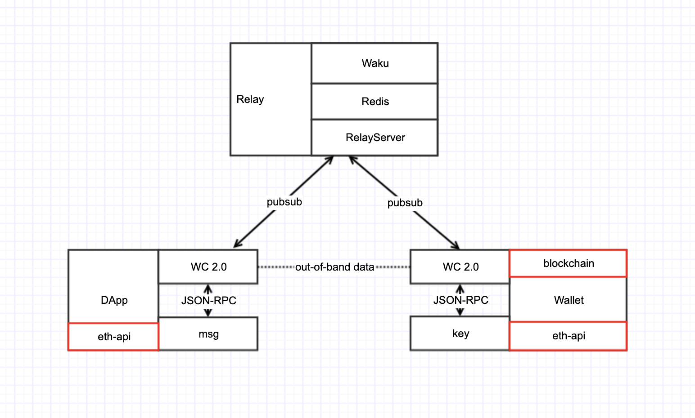
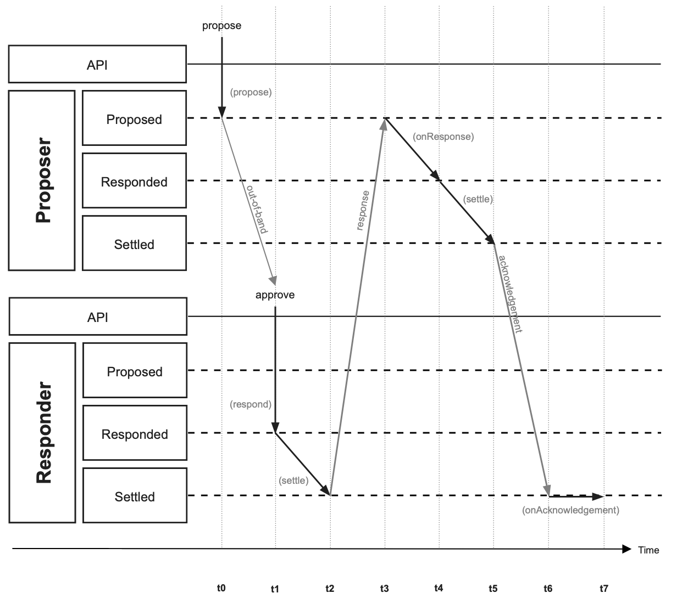

## walletconnect设计

### 一、组件

- 中继服务器
- https://github.com/WalletConnect/walletconnect-monorepo/
	- redis
	- waku
		- https://github.com/status-im/nim-waku 
- ethereum-api
	- https://github.com/paradeum-team/ethereum-api/tree/jyliu
- blockchain-api
	- https://github.com/paradeum-team/blockchain-api/tree/jyliu 	

### 二、架构



- out-of-band-data 外带数据（指Dapp与Wallet通过外部调用携带的参数，如扫二维码获得数据，由钱包解析）
- wc2.0 walletconnect 2.0客户端
- Relay中继服务器
	- RelayServer中继服务
	- Waku服务，这是一个peer节点，也是通讯节点，也是个协议规范
- pubsub 订阅/发布模式
- eth-api是以太坊的api服务节点，自己独立部署
- blockchain 链服务，用来获取公链列表
- 当共享一些带外数据以定义中继基础设施和用于加密有效负载的加密密钥时，两个客户端将连接。
- 通常我们有一个区块链应用程序将被标记为提议者和一个区块链钱包将被标记为响应者。
- 连接后，提议者将以 JSON-RPC 有效负载的形式向响应者发出签名请求，以远程与其签名者签名。

### 三、逻辑



提议者当成DAPP，响应者当成Wallet

- t0 - 提议者生成一个序列提议，其中包括一个带外数据信号并与响应者共享
- t1 - 响应者使用接收到的信号构造提案并批准它，它在内部发送响应
- t2 - 响应者在确认之前乐观地解决会话，同时提议者接收响应
- t3 - Proposer 处理和验证响应并向 Responder 发送响应确认
- t4 - 提议者能够解决它自己的序列，同时响应者接收到确认
- t5 - 响应者处理并验证确认是成功还是失败

### 四、问题

1. Relay使用的协议是什么？
	
	中继协议默认使用的是waku，一些中继协议可能需要一些初始化参数，这些参数需要通过带外通信与另一个 WalletConnect 客户端共享。例如，Bridge 服务器基础设施将包含服务器的 url 作为参数：
	
	```
	interface RelayProtocolOptions {
	  protocol: string;
	  params: any;
	}
	
	const protocolOptions: RelayProtocolOptions = {
	  protocol: "waku",
	  params: {},
	};
	```
	
2. DAPP和钱包通讯逻辑
3. DAPP Public Key生成规则
4. 派生key生成规则，看源码分析
5. Redis存储的数据
6. ws://协议参数说明
	wc:2807b341c5daa1046c8e2f448d424f715349b9d24f6353973ff5a09ab38945db@2?controller=false&publicKey=38b635a94a09205a53c4c03ee08b826b5177015ce9c942c1dce2c8250e197f0f&relay=%7B%22protocol%22%3A%22waku%22%7D
	
	参数说明：

 	- protocol - 由网络上的提议者订阅以接收响应
  	- version - wc的版本
  	- topic - 由网络上的提议者订阅以接收响应
  	- publicKey: 提议者的公钥。X25519 共享密钥派生
   - controller: boolean; 控制器布尔值标识。当为 false 时，表示提议者将不会控制已结算的配对，这意味着它不会更新状态，升级权限，也不受权限的限制。
   - relay  - 用于连接网络的中继协议和参数
 
7. 签名相关问题，看源码分析